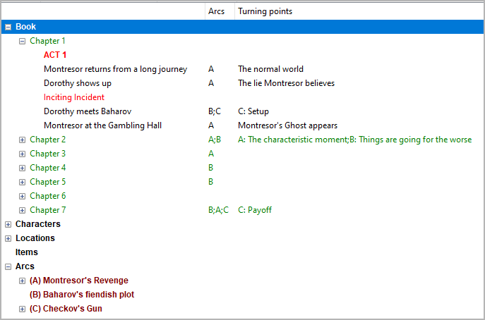

Arc properties
==============

The Arc properties view opens in the right pane when you
select an arc in the tree.

.. figure:: _images/arcView01.png
   :alt: noveltree screenshot

Title and description
---------------------

Title and description are displayed in an editable "index card".

The editing of the title can be completed by pressing the ``Enter`` key.
Changes to the description are applied when the mouse is clicked
anywhere outside the text input field.

Short name
----------

Be sure to enter a short name to be displayed as a reference in the tree.
A single character like "A", "B", "C" is recommended.

   Example: Arc short names as displayed in the tree
   
Section assignments
-------------------

The number of sections that belong to the selected arc is shown
below the "Short name" entry.
You can unlink these sections from the selected arc by clicking
on the **Clear section assignments** button.

Navigation buttons
------------------

- **Previous** moves the selection to the previous arc in the tree.
- **Next** moves the selection to the next arc in the tree.

