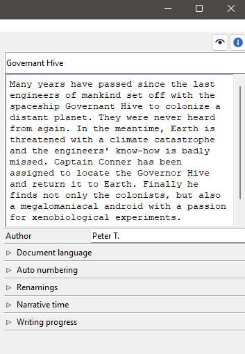
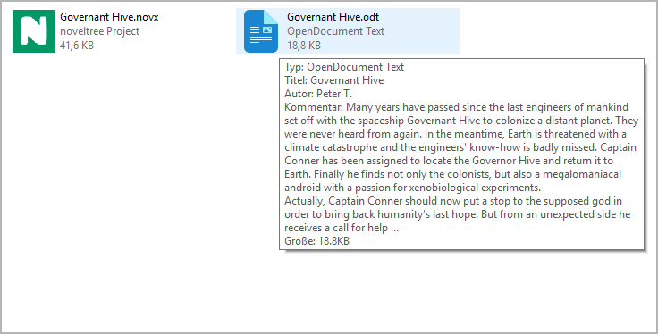
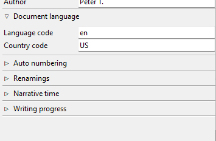
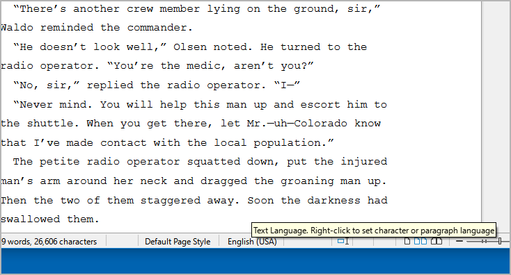
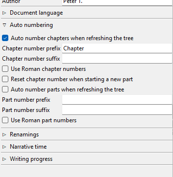
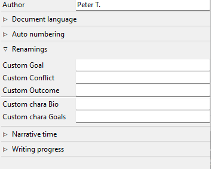
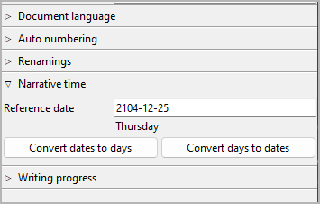
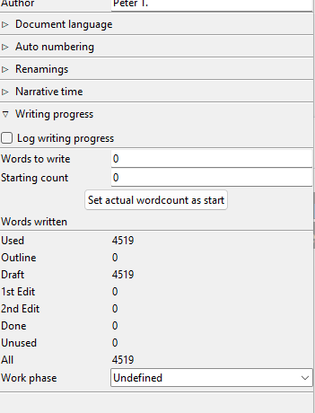

Book properties
===============

.. |ico01| image:: _images/viewBook.png
   :alt: Book

The Book properties view opens in the right pane when you
select "Book" in the tree, or when you click on the |ico01|
toolbar icon. It is the initial view after opening a *noveltree* project.

Title, description, and author
------------------------------

Title and description are displayed in an editable "index card".

The editing of book title and author can be completed by pressing the ``Enter`` key.
Changes to the description are applied when the mouse is clicked
anywhere outside the text input field.

After exporting the book to an *.odt* document, title and description
appear in the document properties.

.. figure:: _images/bookView08.png
   :alt: Screenshot

   LibreOffice Writer screenshot

These properties are visible, for example, when the mouse pointer is over
the document in the Windows Explorer.

   
   Windows 10 Explorer screenshot
   

Document language
-----------------

Expand or collapse this frame by clicking on the label.

- Language code acc. to ISO 639-1
- Country code acc. to ISO 3166-2

This information controls the spelling checker for export documents.

   LibreOffice Writer screenshot

If not set, the System locale setting will be used as default.

.. hint::
   You can also set or change the document language with LibreOffice, then it will be applied on import. 

	.. figure:: _images/bookView11.png
	   :alt: LibreOffice Writer screenshot
	   
	   LibreOffice Writer screenshot

Auto numbering
--------------

Expand or collapse this frame by clicking on the label.

Auto number chapters/parts when refreshing the tree
   If this checkbox is ticked, all chapters/parts are automatically numbered
   each time `the tree is refreshed <file_menu.html#refresh-tree>`__.
   The chapter titles are replaced with a ``prefix-number-suffix``
   pattern (without the dashes).

   .. hint::   
      You can optionally exclude individual chapters/parts from auto-numbering 
      in the `Chapter/part properties <chapter_view.html#do-not-auto-number>`__.

Prefix and suffix entries can be completed by pressing the ``Enter`` key.

.. note::
   Make sure to add a space character to separate the prefix or
   suffix from the chapter or part number.

Use Roman chapter numbers
   By default, arabic numbers, like "1", "2", "3" ... are used for auto-numbering.
   If this checkbox is ticked, Roman numbers, like "I", "II", "III", "IV" ...
   are used instead.

Reset chapter numbers when starting a new part
   By default, the chapters are numbered consistently across the parts.
   If this checkbox is ticked, the chapter numbering starts again with "1"
   in each part.

Renamings
---------

Expand or collapse this frame by clicking on the label.

Narrative time
--------------

Expand or collapse this frame by clicking on the label.

To get an overview of the course of the narrative time, you can enter
date/time information `for each section <section_view.html#date-time>`__.
The date can be specific *(YYYY-MM-DD)* or unspecific (number of days,
e.g. from the beginning of the story).

Reference date
   The reference date is optional. It can be used to convert relative dates
   into absolute dates, or vice versa. The timeline software plugins may
   use the reference date for creating events from sections that have no
   date or an unspecific one.

   Format: *YYYY-MM-DD*, according to ISO 8601.

   .. hint::
      Even if you don't need specific dates for your story, specifying
      a reference date might be helpful. Thus, a day of the week
      can be displayed along with the `unspecific date 
      <section_view.html#start>`__, and ages can be calculated for 
      `related characters <section_view.html#relationships>`__.  

Convert dates to days
   This transforms specific section dates into days, related to the
   reference date.

Convert days to dates
   This transforms unspecific section dates into specific ones, using
   the reference date.

.. note::
   For large novels, the conversion may take some time, depending on 
   your system. During the conversion time, the clicked button will 
   display *"Please wait ..."*.  

.. hint::
   The commands above convert all dated sections at once. If you want to 
   do the conversion for single sections, just go to the 
   `Section properties view <section_view.html#start>`__.
   

Writing pogress
---------------

Expand or collapse this frame by clicking on the label.

With *noveltree*, you can set a word count target and track your
writing progress.

.. note::
   Regardless of the entries made here, you can see the word count 
   in the status bar at any time. 

Log writing progress
   By default, *noveltree* stores a log entry with the word counts
   for each day on which you edit the project. You can prevent
   this by unticking the **Log writing progress** checkbox.

   .. hint::
      For viewing the daily progress log, you may want to 
      install the `nv_progress plugin 
      <https://peter88213.github.io/nv_progress/>`__.

Words to write
   Here you can enter a number (without decimal points or separators)
   indicating your writing goal in words.
   The entry can be completed by pressing the ``Enter`` key.

Starting count
   Here you can enter a number (without decimal points or separators)
   indicating the word count you want to start from.
   The entry can be completed by pressing the ``Enter`` key.

Set actual wordcount as start
   Click this button to enter your current word count in the **Starting
   count** field.

Words written
   Here the difference between your actual word count and the starting
   count is displayed. The percentage refers to the words to write.

Work phase
   This setting is for the tree viewer `"Work phase" coloring mode
   <view_menu.html#coloring-mode>`__.

   - Sections with the same completion status as the selected work
     phase are black.
   - Sections that are ahead of the selected work phase are green.
   - Sections that are behind the selected work phase are magenta.

Cover thumbnail
---------------

A cover thumbnail is displayed with the book properties if you
provide a PNG image file with the project name along with the *.novx*
file. The recommended image width is 100 to 200 pixels.

.. figure:: _images/bookView12.png
   :alt: Windows 10 Explorer screenshot
   
   Windows 10 Explorer screenshot
   
.. figure:: _images/bookView07.jpg
   :alt: noveltree screenshot

   noveltree screenshot

