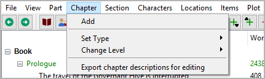
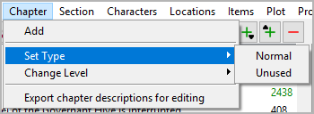
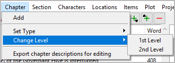

Chapter menu
============

**Chapter operation**

Add
---

**Add a new chapter**

You can add a chapter to the tree with **Chapter > Add**.

-  The new chapter is placed at the next free position after the selection, if
   possible. - Otherwise, the new chapter is placed at the end of the
   “Book” branch.
-  The new chapter has an auto-generated title. You can change it in the right pane.

Set Type
--------

**Set the type of the selected chapters**

The `type <basic_concepts.html#part-chapter-section-types>`__ of
the selected chapter can be *Normal* or *Unused*.

.. hint::
   Setting the type of a chapter to *Unused* will also make its sections *Unused*.

Change Level
------------

**Change the level of the selected chapters**

-  **1st Level** converts the selected parts into chapters.
-  **2nd Level** converts the selected chapters into parts.

Export chapter descriptions for editing
---------------------------------------

**Export an ODT document**

This will generate a new OpenDocument text document (odt) containing a
**brief synopsis** with part/chapter headings and chapter descriptions
that can be edited and written back to project format. File name suffix
is ``_chapters_tmp``.

