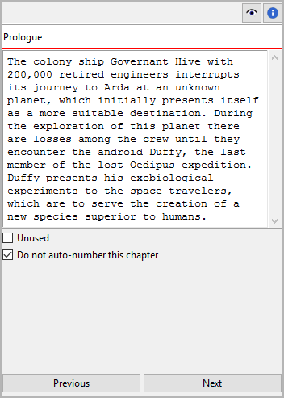

Chapter/part properties
=======================

The Chapter/part properties view opens in the right pane
when you select a chapter or a part in the tree.
You can edit the properties of the selected chapter or part.

.. hint::
   You can change any chapter into a part or vice versa via the **Change
   Level** entry in the context menu, the **Part** menu, or the **Chapter** 
   menu.
   

Title and description
---------------------

Title and description are displayed in an editable "index card".

The editing of the title can be completed by pressing the ``Enter`` key.
Changes to the description are applied when the mouse is clicked
anywhere outside the text input field.

_`Do not auto-number` this chapter/part
   If this checkbox is ticked, the title of the selected chapter
   or part will remain untouched when the chapters are
   `auto-numbered <book_view.html#auto-numbering>`_.

Navigation buttons
------------------

Chapter view
	- **Previous** moves the selection to the previous chapter in the tree.
	- **Next** moves the selection to the next chapter in the tree.

Part view
	- **Previous** moves the selection to the previous part in the tree.
	- **Next** moves the selection to the next part in the tree.
