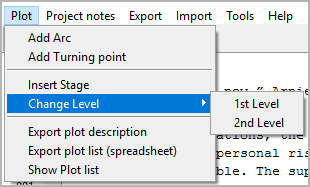

Plot menu
=========

**Plot elements operation**

.. figure:: _images/plotMenu01.png
   :alt: noveltree screenshot

Add Arc
-------

**Add a new story arc**

You can add a project note to the tree with **Plot > Add arc**.

-  If an arc is selected, the new item is placed after the selected one.
-  Otherwise, the new arc is placed at the last position.
-  The new arc has an auto-generated title. You can change it in the
   right pane.

Add Turning point
-----------------

**Add a new Turning point to the selected arc**

You can add a turning point to an arc with **Plot > Add arc**.

- If a turning point is selected, the new turning point is placed after the selected one.
- If an arc is selected, the new turning point is placed at the last position.
- Otherwise, no new turning point is generated.
- The new turning point has an auto-generated title. You can change it in
  the right pane.

Insert Stage
------------

**Insert a stage between the sections**

This inserts a stage after the selected chapter or section.
By default, the new stage is on the second level. You can
change the level to first (see below).

Change Level
------------

**Change the level of the selected stages**

-  **1st Level** is displayed in bold face.
-  **2nd Level** is displayed in regular font.

.. note::
   The stage level is only for visual distinction. It has no
   influence on the program functions. 

Export plot description
-----------------------

**Export an ODT document**

This will generate a new OpenDocument text document (odt) containing
stages, arcs, and turning points, each with description.
File name suffix is ``_plot``.

Export plot list (spreadsheet)
------------------------------

**Export an ODS document**

This will generate a new OpenDocument spreadsheet (ods) containing a
table with a row for each section and a column for each arc.
Associations between arcs and sections are color-highlighted.
Turning point titles are displayed.

The arc titles and the section titles are hyperlinked to the
respective descriptions in other exported documents, if any.

File name suffix is ``_plotlist``.

.. figure:: _images/plotMenu04.png
   :alt: LibreOffice screenshot

   LibreOffice screenshot. Note the hyperlink from the arc title in the
   plot list (left) to the arc in the plot description (right). 

Show plot list
--------------

**Show an HTML report with plot elements**

This will generate a list-formatted HTML file, and launch your system’s
web browser for displaying it. The HTML plot list is similar to the
ODS plot list (see above), but without any hyperlinks.

.. figure:: _images/plotMenu03.jpg
   :alt: Edge browser screenshot

   Edge browser screenshot

-  The Report is a temporary file, auto-deleted on program exit.
-  If needed, you can have your web browser save or print it.

