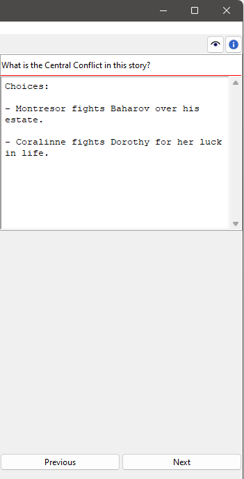

Project note properties
=======================

The Project note properties view opens in the right pane when you 
select a project note in the tree.
You can edit the properties of the selected project note.

Title and content
-----------------

Title and content are displayed in an editable "index card". 

The title can be completed by pressing the ``Enter`` key. 
Changes to the content are applied when the mouse is clicked 
anywhere outside the text input field. 

Navigation buttons
------------------

- **Previous** moves the selection to the previous project note in the tree.
- **Next** moves the selection to the next project note in the tree.
