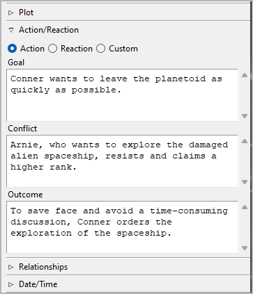
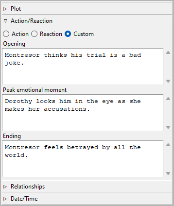
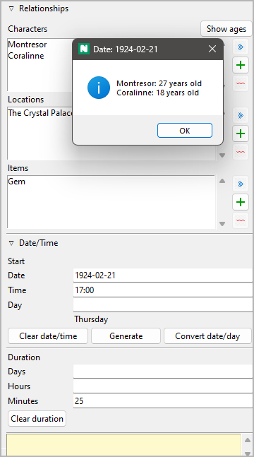
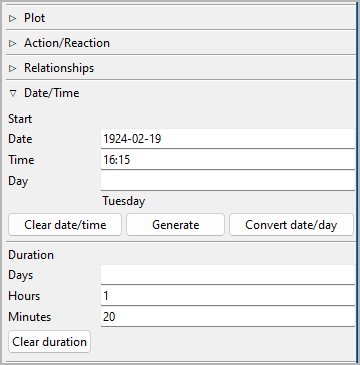

Section properties
==================

The Section properties view opens in the right pane when you
select a section in the tree.

.. figure:: _images/sectionView01.png
   :alt: Screenshot

Title and description
---------------------

Title and description are displayed in an editable "index card".

The editing of the title can be completed by pressing the ``Enter`` key.
Changes to the description are applied when the mouse is clicked
anywhere outside the text input field.

Tags
----
Tags are a very freely usable tool for labeling sections in the
tree view. Tags do not have to be defined elsewhere, but simply
entered in the input field separated by semicolons.
Editing can be completed by pressing the ``Enter`` key.

.. caution::
   If you want to use a tag more than once, make sure you use 
   the same spelling in the different places. 

Viewpoint
---------

The viewpoint character's short name is displayed in the tree view.
You can select it from a drop-down list containing all characters
in the tree view's sort order.

Plot
----

Expand or collapse this frame by clicking on the label.

.. figure:: _images/sectionView04.png
   :alt: Screenshot

Arcs
~~~~

Here you can assign the selected section to the arcs it belongs to.
The assigned arcs are displayed in a list in the order they are
assigned to the section.

.. hint::
   A more convenient way to manage and keep track of arc assignments is 
   offered by the `noveltree_matrix plugin 
   <https://peter88213.github.io/noveltree_matrix/>`__. 

Add arc assignment
   When clicking on |Add|, the "Pick mode"
   is activated, and the cursor changes to a "plus" shape. By clicking
   on an arc, it will be related with the section.

   .. hint::
      You can exit the "Pick mode" without selecting an element by
      clicking on the highlighted status bar, or by pressing the ``Esc``
      key. 

Remove arc assignment
   When clicking on |Remove| or pressing the ``Del`` key,
   the selected arc is removed from the list.

View the related element
   When double-clicking on an arc, or clicking on |Goto|,
   the selected arc is opened and its properties are displayed.

   .. hint::
      You can go back to the initially selected section with |Go Back|. 

Turning points
~~~~~~~~~~~~~~

The turning points assigned with the selected section are displayed
along with their arcs.

.. hint::
   To change or clear the turning point assignment, go to the
   `turning point's properties <point_view.html#assigned-section>`__.

Action/Reaction
---------------

Expand or collapse this frame by clicking on the label.

There is a popular theory for "selling writers" that suggests novels
are best divided into scenes, alternating between "action scenes" and
"reaction scenes", or "scenes" and "sequels". If you want to implement
something like this to ensure suspense, you can do so here.

If this is not for you, but you would like to use a different method
to set up a dramaturgical scene micro-structure, you can set the section
to **Custom** and get three `freely named <book_view.html#renamings>`_
text fields.

   
   Example of a user-defined scene category

.. note::
   The "Goal/Conflict/Outcome" data is only for working with *noveltree*.
   It is not meant to be exported into a document.
   However, it all appears in the `section list`_.

Relationships
-------------

Expand or collapse this frame by clicking on the label.

If you want to associate characters, locations, and items with the
section, you can do it here by adding the element to a list of
relationships.

Show ages
   If a section is dated, you can call up the ages of the related
   characters who have `birth dates <character_view.html#bio>`__.

Add Relationship
   When clicking on |Add|, the "Pick mode"
   is activated, and the cursor changes to a "plus" shape. By clicking
   on a character/location/item, this element will be related with the
   section.

   .. hint::
      You can exit the "Pick mode" without selecting an element by
      clicking on the highlighted status bar, or by pressing the ``Esc``
      key. 

Remove Relationship
   When clicking on |Remove| or pressing the ``Del`` key,
   the selected relationship is removed from the list.

View the related element
   When double-clicking on a related element, or clicking on |Goto|,
   the selected element is opened and its properties are displayed.

   .. hint::
      You can go back to the initially selected section with |Go Back|. 

.. hint::
   A convenient way to manage and keep track of relationships is offered 
   by the `noveltree_matrix plugin 
   <https://peter88213.github.io/noveltree_matrix/>`__. 

.. |Add| image:: _images/add.png
.. |Goto| image:: _images/goto.png

.. |Go back| image:: _images/goBack.png

Date/Time
---------

Here you can enter information about the selected section's narrative time.

.. hint::
   Dedicated timeline software offers a more convenient way of entering date/time 
   and duration information. So if chronology is important to your story, you
   might want to take a look at the `Timeline plugin 
   <https://peter88213.github.io/noveltree_timeline/>`__, or the 
   `Aeon Timeline 2 plugin <https://peter88213.github.io/noveltree_aeon2/>`__.

Start
~~~~~

If the selected section is a scene, this is when it starts:

Date
   Format: *YYYY-MM-DD*, according to ISO 8601.

Time
   Format: *hh:mm*, according to ISO 8601.

Day
   Format: Any number. Day "0" is the `reference date
   <book_view.html#narrative-time>`_, if set.

.. note::
   All entries are optional. You can either enter a date, or a day. 
   
Clear date/time
   This removes Date/Time/Day data from the selected section.

Generate
   This generates date and time from the date/time/duration data of the
   `previous section <Navigation buttons_>`_, so the selected section
   follows directly the previous one.

Convert date/day
   If the `reference date <book_view.html#narrative-time>`__ is set,
   The implicit *Day* can be transformed into an explicit *Date*,
   and vice versa.

   .. hint::
      If necessary, you can convert all sections at once in the 
      `Book properties view <book_view.html#narrative-time>`__.
   

Duration
~~~~~~~~

"Sticky note"
-------------

The yellow text area is for notes. Changes are applied
when the mouse is clicked anywhere outside the text input field.

When the "sticky note" of a section contains text, an "N" is
displayed in the tree view as a reminder. If the branch of a chapter
with sections containing notes is collapsed, the "N" is displayed
in the chapter row.

.. note::
   The "sticky notes" are only for working with *noveltree*.
   They are not meant to be exported into a document.
   However, they appear in the `section list`_.

.. _section list: section_menu.html#export-section-list-spreadsheet

Navigation buttons
------------------

- **Previous** moves the selection to the previous section in the tree.
- **Next** moves the selection to the next section in the tree.
